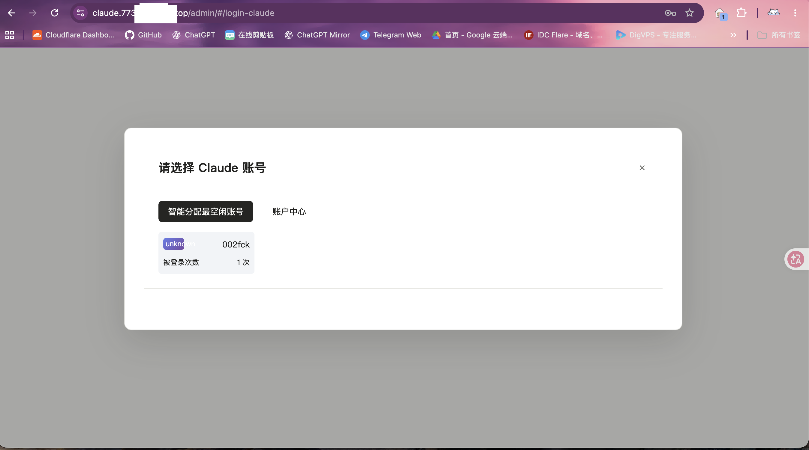
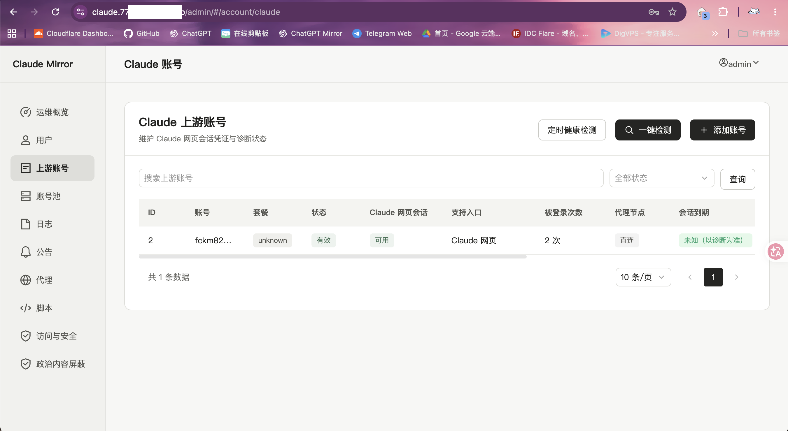
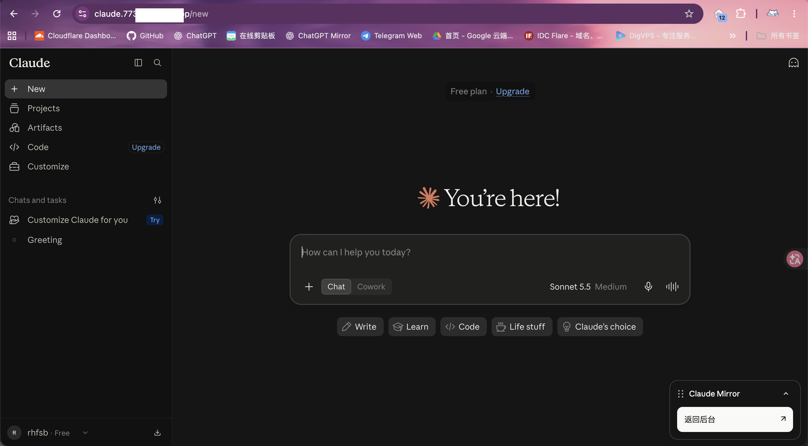
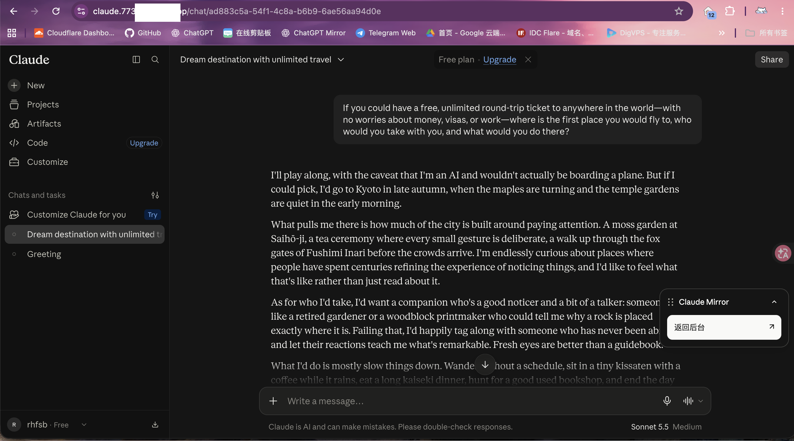

# Claude Mirror

面向个人与团队的 Claude 网页镜像，提供站点登录、账号池管理、用户授权，以及项目与对话隔离。用户通过镜像站使用已获授权的 Claude 账号，管理员在后台管理账号、用户与使用配额。
由于部分功能从[`ChatGPT-mirror`](https://github.com/Jasa-Chi-Ray/chatgpt-mirror)迁移过来，可能需要一点针对 Claude 的适配时间

## 功能

- 管理 Claude 账号、账号池和站点用户，按用户分配访问权限。
- 按镜像用户隔离项目、项目文档与文件，以及对话；限制跨用户访问和修改。
- 设置用户每日、每月使用配额，查看运行状态与日志。
- 导入 Claude sessionKey 或包含 sessionKey 的 Cookie，查看账号可用状态。
- 在聊天页面通过可折叠、可拖动的浮窗返回后台，保留窗口位置与折叠状态。
- 支持 Linux AMD64 与 ARM64，Docker 自动选择对应架构的镜像。

项目与对话隔离依赖本站记录的资源归属。旧 Claude 历史不会自动分配给新用户，无法确认归属的资源可能不可访问。上游账号权限、服务状态与网页协议变化也可能影响功能。

## 请求模式：推荐 wreq

**推荐使用 `wreq`，新配置默认选择此模式。** 它支持浏览器网络特征模拟与连接复用，适合本项目的 Claude 网页访问。已有部署升级后可能保留原来的模式，需要在后台确认。

| 模式 | 主要区别 | 本项目建议 |
| --- | --- | --- |
| [`reqwest`](https://github.com/seanmonstar/reqwest) | 通用 HTTP 客户端，支持 HTTPS、HTTP/2 与连接复用，不内置浏览器网络特征模拟。修改 User-Agent 不会使其握手变成浏览器握手。 | 用于常规网络兼容性检查或排障对照。 |
| [`wreq`](https://github.com/0x676e67/wreq) | 支持浏览器风格的 TLS 握手和 HTTP/2 特征，同时保留连接池；能够模拟的范围比单独修改请求头更广。 | **首选模式**，首次部署保持默认；已有部署建议切换后验证。 |
| [`curl-impersonate`](https://github.com/lexiforest/curl-impersonate) | 基于修改后的 curl/libcurl 模拟浏览器的 TLS 与 HTTP/2 特征。与 `wreq` 使用不同的客户端方案，实际兼容性需分别验证。 | 本项目中的实验模式，用于替代方案测试与问题对照。 |

TLS 握手是建立 HTTPS 连接时交换的协议参数；HTTP/2 特征还包括设置与帧行为。上游服务能观察这些信息，因此“请求头看起来相同”不代表三种模式的网络特征相同。两种仿真方案也不保证拥有完全一致的浏览器特征，或通过上游的所有检查。

管理员可在后台的“代理”页面，通过“HTTP 传输”选择模式。切换成功后会提示“已切换为对应模式”，无需修改 `.env` 或重新构建镜像。切换后建议验证账号导入、打开对话与生成回复是否正常。

模式选择不会改变服务器的实际出口地区；账号权限、出口可用性与上游服务策略仍会影响使用结果。这里推荐 `wreq` 是基于项目的网页访问需求，不代表三种模式之间存在经过统一实测的性能排名。

## 界面截图

### 选择账号



### 后台



### 界面



### 对话



## 部署前准备

- 安装 Docker Engine 和 Docker Compose 插件，确认 `docker compose version` 可用。
- 准备可访问 Claude 服务的服务器出口，以及有效且已获授权使用的 Claude 账号。
- 准备 HTTPS 域名和反向代理，将请求转发至服务器本机的 `41002` 端口。
- 将 [.env.example](.env.example) 与 [docker-compose.yml](docker-compose.yml) 放在同一部署目录。

默认镜像为 `lisa666520/claude-mirror:latest`。部署只需拉取镜像，无需安装开发工具或编译源码。

## 首次启动

在部署目录执行：

```sh
cp .env.example .env
chmod 600 .env
```

编辑 `.env`，填写管理员密码、三项独立密钥与实际访问域名。模板中的必填凭据为空，未填写时 Compose 会拒绝启动。

每项密钥分别运行一次以下命令生成，不要复用同一个值：

```sh
openssl rand -hex 32
```

| 配置项 | 用途 |
| --- | --- |
| `ADMIN_USERNAME`、`ADMIN_PASSWORD` | 首次部署时初始化管理员账号 |
| `GATEWAY_ADMIN_SECRET` | 服务密钥，至少 32 字符 |
| `CREDENTIAL_ENCRYPTION_KEY` | 凭据加密密钥，至少 32 字符，升级时必须保留 |
| `DJANGO_SECRET_KEY` | 站点安全密钥，使用独立随机值 |
| `DJANGO_ALLOWED_HOSTS` | 允许访问的主机名，逗号分隔，不包含协议和路径 |
| `DJANGO_CSRF_TRUSTED_ORIGINS` | 可信访问来源，填写完整 HTTPS 来源，多个来源用逗号分隔 |
| `PORT` | 服务器监听端口，默认 `41002` |
| `BIND_ADDRESS` | 监听地址，默认 `127.0.0.1`，供同机反向代理访问 |
| `DATA_DIR` | 持久化数据目录，默认 `./data` |
| `ALLOW_REGISTER` | 是否开放注册，默认 `false` |
| `TRUSTED_PROXY_IPS` | 可选，仅填写实际反向代理的可信来源 IP |

域名配置示例：

```dotenv
DJANGO_ALLOWED_HOSTS=mirror.example.com,localhost,127.0.0.1
DJANGO_CSRF_TRUSTED_ORIGINS=https://mirror.example.com
```

完成配置后，启动：

```sh
docker compose pull
docker compose up -d
docker compose ps
```

通过 HTTPS 打开 `https://你的域名/admin/`，使用配置的管理员账号登录。容器启动后需要短暂初始化，`ps` 中应显示服务正在运行，健康状态随后变为 `healthy`。

模板面向 HTTPS 部署，安全 Cookie 默认开启。不要直接用公网 HTTP 地址代替 HTTPS 访问，否则浏览器可能无法保留登录状态。

## 添加账号与用户

1. 在后台的“Claude 账号”中添加有效的 sessionKey 或 Cookie。
2. 将账号加入账号池，并把账号池分配给站点用户。
3. 根据需要设置“项目与对话隔离”及使用配额。
4. 用户登录本站，选择获授权账号进入 Claude 网页。

sessionKey 是敏感登录凭据，不应放入配置模板、公开仓库或问题反馈。账号状态与实际验证结果为准；Cookie 文件标注的到期时间不保证会话持续有效。退出镜像站后，可重新通过站点登录进入。

## 更新与迁移

更新前保留 `.env` 和数据目录，在部署目录执行：

```sh
docker compose  pull
docker compose  up -d
```

更新后重新加载浏览器页面；遇到旧界面或旧跳转时执行强制刷新。

从旧 ChatGPT 镜像升级时，保留原数据目录与原有密钥。既有站点用户、授权及兼容数据会按升级流程读取，旧平台凭据不能用于 Claude，需要重新录入 Claude 账号。不要重置加密密钥，也不要手动重命名数据目录中的数据库文件。


## 日志、备份与故障排查

查看最近日志：

```sh
docker compose --env-file .env -f docker-compose.yml logs --tail=100 claude-mirror
```

备份包含 `.env` 与 `DATA_DIR` 指向的完整目录。复制运行中的数据库可能得到不一致的备份，先停止服务，再备份并启动：

```sh
docker compose --env-file .env -f docker-compose.yml stop
# 将 .env 与数据目录完整复制到受保护的备份位置。
docker compose --env-file .env -f docker-compose.yml up -d
```

| 现象 | 检查方向 |
| --- | --- |
| Compose 提示必填变量缺失 | 确认 `.env` 已填写密码与三项独立密钥，并使用了正确的 `--env-file` |
| 浏览器无法登录或提示来源错误 | 检查 HTTPS、允许主机名与可信来源是否对应实际访问地址 |
| 反向代理无法连接 | 检查容器状态、`PORT` 与 `BIND_ADDRESS`，默认服务仅监听本机 |
| 导入账号失败或会话不可用 | 检查凭据、服务器出口及日志中的错误；重新获取当前有效的登录凭据 |
| 旧对话或项目不可见 | 检查用户的账号池授权与隔离设置，旧历史不会自动归属新用户 |

反馈问题时提供软件版本、操作步骤与去除敏感信息的错误日志，不提交完整 Cookie、sessionKey、密钥或含登录凭据的 HAR 文件。
